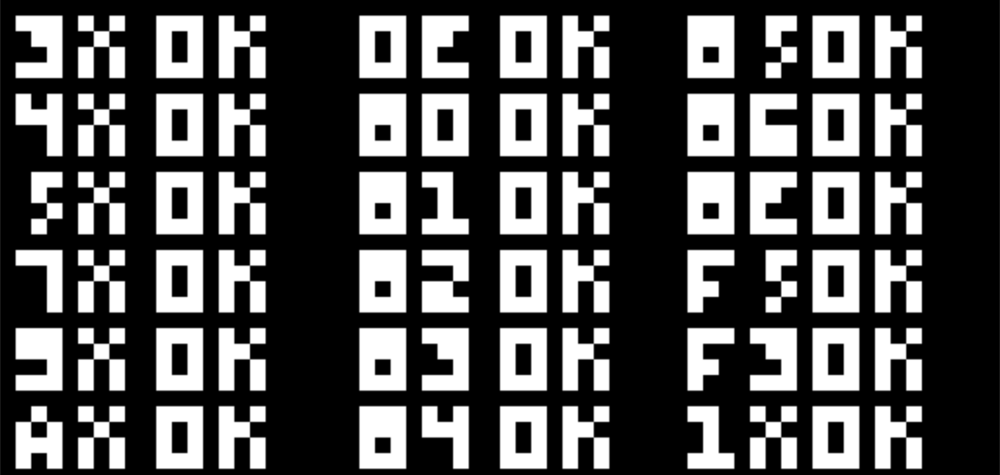

# chip8.rs

> chip8 written in rust lang

## Usage

```
cargo run <rom_file>
```

There are some ROMs I used to test the project.

[test_opcode.ch8](https://github.com/corax89/chip8-test-rom)

```
cargo run roms/test_opcode.ch8
```

Output should be similar to



OpCodes tested with this ROM:

```
3XNN	00EE	8XY5
4XNN	8XY0	8XY6
5XY0	8XY1	8XYE
7XNN	8XY2	FX55
9XY0	8XY3	FX33
ANNN	8XY4	1NNN
```

## Keypad

The keypad used has 16 keys. There is more than one layout out there but this emulator uses the following:

|   |   |   |   |
|---|---|---|---|
| 1 | 2 | 3 | 4 |
| Q | W | E | R |
| A | S | D | F |
| Z | X | C | V |


Thanks to BestCoder (bestcoder@ymail.com) for the `BC_test.ch8` rom.